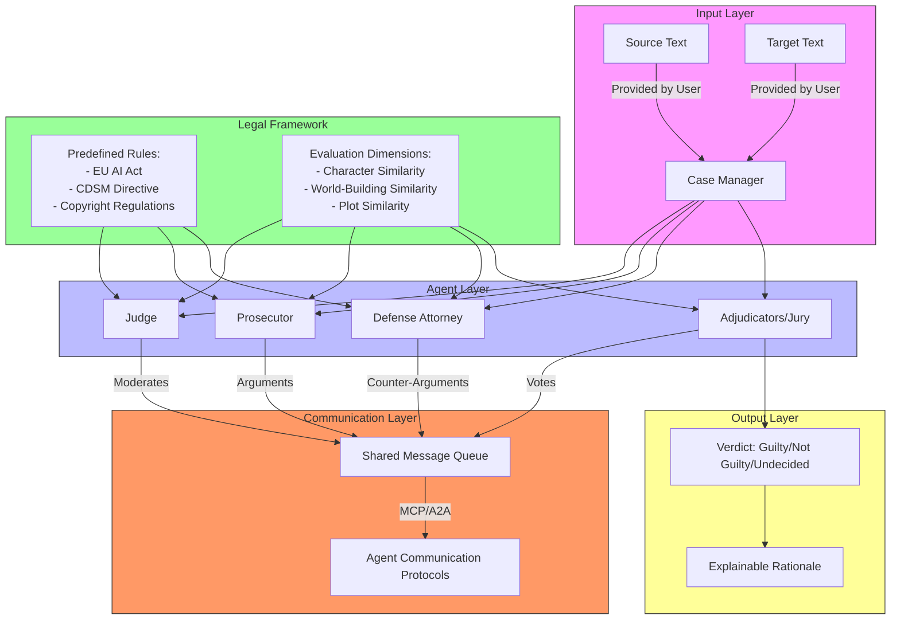
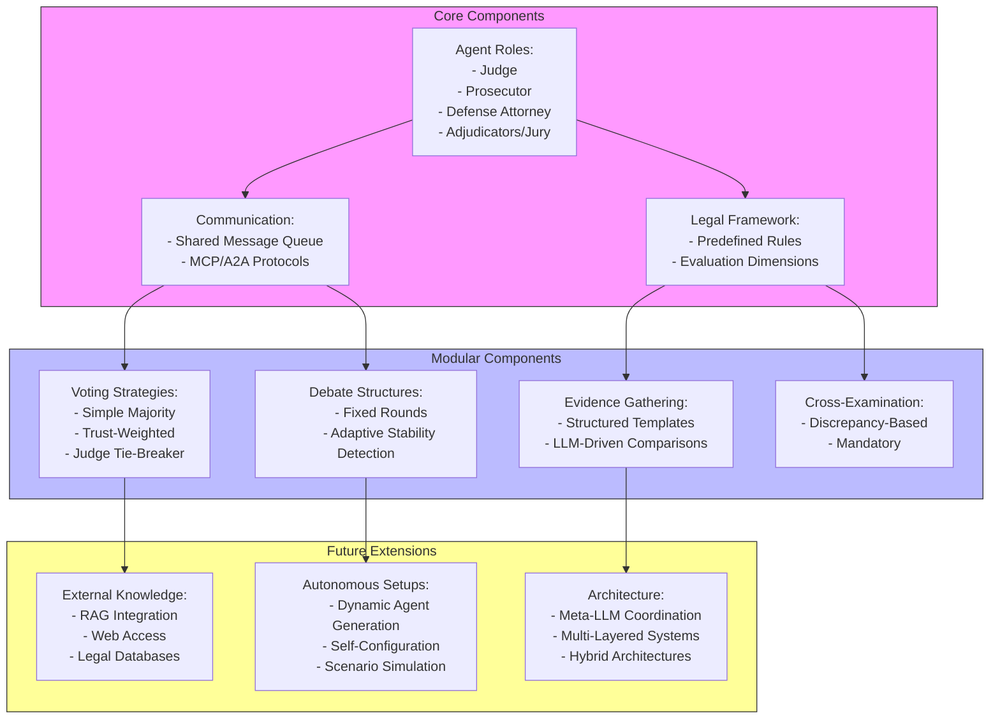
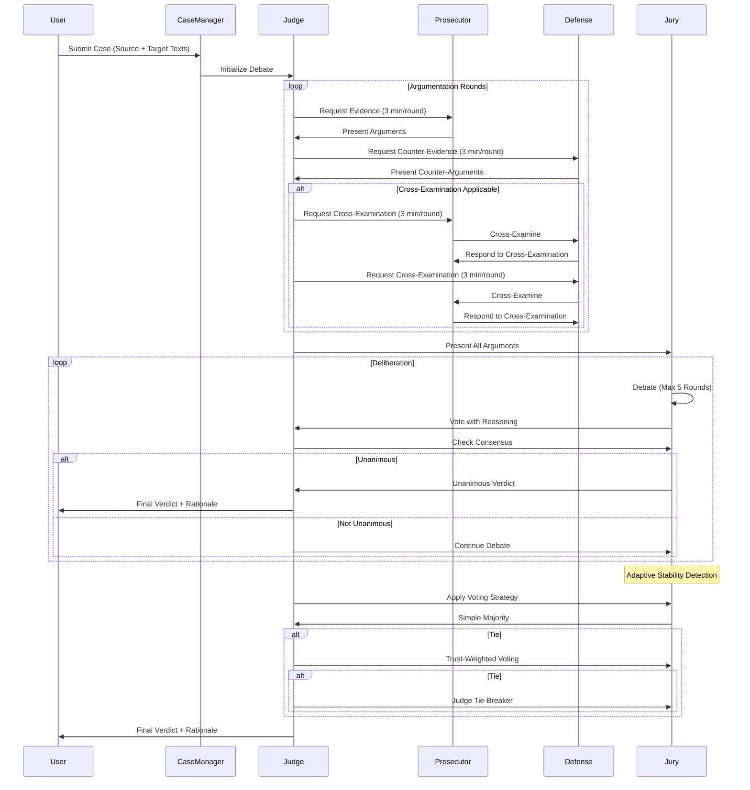
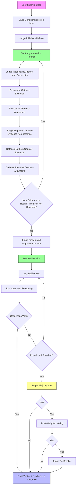

# Diagrams: PSALM 2.0 Courtroom-inspired Multi-Agent system for EU Copyright Infringement Evaluation
## High-Level Architecture

```mermaid
flowchart TD
    subgraph Input[Input Layer]
        A[Source Text] -->|Provided by User| B[Case Manager]
        C[Target Text] -->|Provided by User| B
    end
    
    subgraph Agents[Agent Layer]
        B --> D[Judge]
        B --> E[Prosecutor]
        B --> F[Defense Attorney]
        B --> G[Adjudicators/Jury]
    end
    
    subgraph Communication[Communication Layer]
        D -->|Moderates| H[Shared Message Queue]
        E -->|Arguments| H
        F -->|Counter-Arguments| H
        G -->|Votes| H
        H -->|MCP/A2A| I[Agent Communication Protocols]
    end
    
    subgraph Legal[Legal Framework]
        J[Predefined Rules:
        - EU AI Act
        - CDSM Directive
        - Copyright Regulations] --> D
        J --> E
        J --> F
        K[Evaluation Dimensions:
        - Character Similarity
        - World-Building Similarity
        - Plot Similarity] --> D
        K --> E
        K --> F
        K --> G
    end
    
    subgraph Output[Output Layer]
        G --> L[Verdict: Guilty/Not Guilty/Undecided]
        L --> M[Explainable Rationale]
    end
    
    style Input fill:#f9f,stroke:#333
    style Agents fill:#bbf,stroke:#333
    style Communication fill:#f96,stroke:#333
    style Legal fill:#9f9,stroke:#333
    style Output fill:#ff9,stroke:#333
```

## Component Diagram

```mermaid
flowchart TB
    subgraph Core[Core Components]
        A[Agent Roles:
        - Judge
        - Prosecutor
        - Defense Attorney
        - Adjudicators/Jury]
        B[Communication:
        - Shared Message Queue
        - MCP/A2A Protocols]
        C[Legal Framework:
        - Predefined Rules
        - Evaluation Dimensions]
    end
    
    subgraph Modular[Modular Components]
        D[Voting Strategies:
        - Simple Majority
        - Trust-Weighted
        - Judge Tie-Breaker]
        E[Debate Structures:
        - Fixed Rounds
        - Adaptive Stability Detection]
        F[Evidence Gathering:
        - Structured Templates
        - LLM-Driven Comparisons]
        G[Cross-Examination:
        - Discrepancy-Based
        - Mandatory]
    end
    
    subgraph Future[Future Extensions]
        H[External Knowledge:
        - RAG Integration
        - Web Access
        - Legal Databases]
        I[Autonomous Setups:
        - Dynamic Agent Generation
        - Self-Configuration
        - Scenario Simulation]
        J[Architecture:
        - Meta-LLM Coordination
        - Multi-Layered Systems
        - Hybrid Architectures]
    end
    
    A --> B
    A --> C
    B --> D
    B --> E
    C --> F
    C --> G
    D --> H
    E --> I
    F --> J
    
    style Core fill:#f9f,stroke:#333
    style Modular fill:#bbf,stroke:#333
    style Future fill:#ff9,stroke:#333
```

## Sequence Diagram

```mermaid
sequenceDiagram
    participant User
    participant CaseManager
    participant Judge
    participant Prosecutor
    participant Defense
    participant Jury
    
    User->>CaseManager: Submit Case (Source + Target Texts)
    CaseManager->>Judge: Initialize Debate
    
    loop Argumentation Rounds
        Judge->>Prosecutor: Request Evidence (3 min/round)
        Prosecutor->>Judge: Present Arguments
        Judge->>Defense: Request Counter-Evidence (3 min/round)
        Defense->>Judge: Present Counter-Arguments
        
        alt Cross-Examination Applicable
            Judge->>Prosecutor: Request Cross-Examination (3 min/round)
            Prosecutor->>Defense: Cross-Examine
            Defense->>Prosecutor: Respond to Cross-Examination
            Judge->>Defense: Request Cross-Examination (3 min/round)
            Defense->>Prosecutor: Cross-Examine
            Prosecutor->>Defense: Respond to Cross-Examination
        end
    end
    
    Judge->>Jury: Present All Arguments
    
    loop Deliberation
        Jury->>Jury: Debate (Max 5 Rounds)
        Jury->>Judge: Vote with Reasoning
        Judge->>Jury: Check Consensus
        
        alt Unanimous
            Jury->>Judge: Unanimous Verdict
            Judge->>User: Final Verdict + Rationale
        else Not Unanimous
            Judge->>Jury: Continue Debate
        end
    end
    
    Note over Jury: Adaptive Stability Detection
    Judge->>Jury: Apply Voting Strategy
    Jury->>Judge: Simple Majority
    alt Tie
        Judge->>Jury: Trust-Weighted Voting
        alt Tie
            Judge->>Jury: Judge Tie-Breaker
        end
    end
    Judge->>User: Final Verdict + Rationale
```

## Flowchart

```mermaid
flowchart TD
    A[User Submits Case] --> B[Case Manager Receives Input]
    B --> C[Judge Initializes Debate]
    
    C --> D[Start Argumentation Rounds]
    D --> E[Judge Requests Evidence from Prosecutor]
    E --> F[Prosecutor Gathers Evidence]
    F --> G[Prosecutor Presents Arguments]
    G --> H[Judge Requests Counter-Evidence from Defense]
    H --> I[Defense Gathers Counter-Evidence]
    I --> J[Defense Presents Counter-Arguments]
    
    J --> K{New Evidence or Round/Time Limit Not Reached?}
    K -->|Yes| D
    K -->|No| L[Judge Presents All Arguments to Jury]
    
    L --> M[Start Deliberation]
    M --> N[Jury Deliberates]
    N --> O[Jury Votes with Reasoning]
    O --> P{Unanimous Vote?}
    P -->|Yes| Q[Final Verdict + Synthesized Rationale]
    P -->|No| R{Round Limit Reached?}
    R -->|No| N
    R -->|Yes| S[Simple Majority Vote]
    S --> T{Tie?}
    T -->|No| Q
    T -->|Yes| U[Trust-Weighted Voting]
    U --> V{Tie?}
    V -->|No| Q
    V -->|Yes| W[Judge Tie-Breaker]
    W --> Q

    style A fill:#f9f,stroke:#333
    style Q fill:#bbf,stroke:#333
    style D fill:#9f9,stroke:#333
    style M fill:#9f9,stroke:#333
    style S fill:#ff9,stroke:#333
```